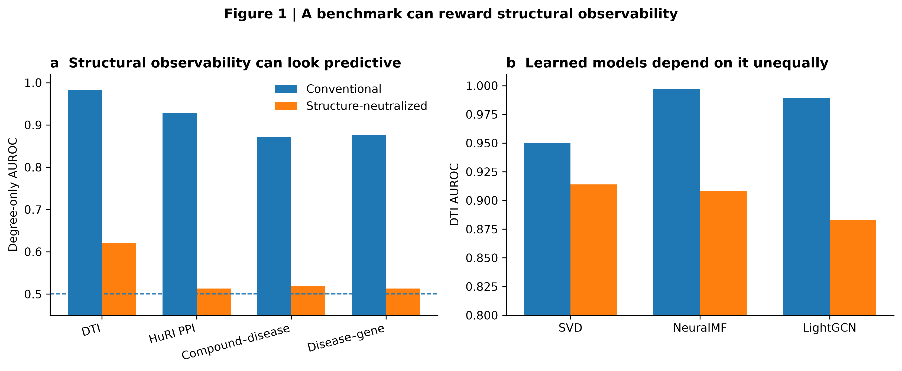
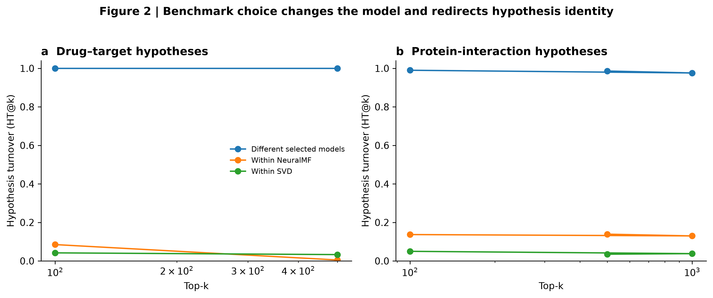
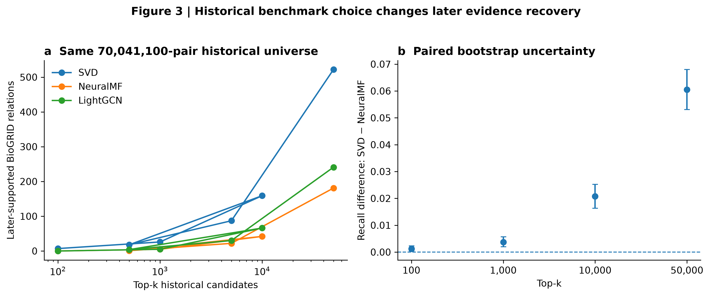
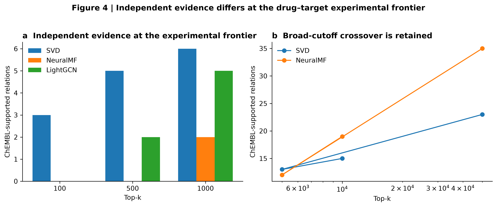

# Benchmark design redirects biomedical discovery

Adeeb Noor  
Department of Information Technology, Faculty of Computing and Information Technology, King Abdulaziz University, Jeddah, Saudi Arabia

**Article type:** Research Article  
**Status:** PRE-SUBMISSION — the core evidence is frozen; the prespecified leakage-free contemporary-model robustness result will be added without changing its criterion before submission.

## Abstract

Biomedical AI increasingly determines which molecular relations are prioritized for experiments, yet models are often selected on benchmarks that contrast known relations with sampled unknown pairs. Across four relation families, structural observability alone produced strong discrimination and affected learned models unequally, reversing the selected model in drug–target and protein-interaction analyses. These reversals changed 100% and 99% of top-100 hypotheses, respectively, far beyond within-model instability. In a frozen historical BioGRID network, the model selected after structural neutralization recovered 522 of 5,635 later-added interactions among its top 50,000 predictions versus 181 for the conventional winner. Independent ChEMBL evidence was also more concentrated at the earliest drug–target cutoffs, although the advantage did not persist at broad cutoffs. Thus benchmark design can redirect biomedical discovery by changing which model wins and which biology is tested first.

## Introduction

Biomedical artificial intelligence is increasingly used upstream of experiments: to rank drug targets, nominate protein interactions, prioritize disease genes and decide which candidate relations deserve scarce laboratory or clinical follow-up. In that setting, model selection is itself a scientific decision. The model that wins a benchmark often becomes the scoring function that determines what biology is tested next.

Yet biological relation benchmarks are not neutral collections of exchangeable pairs. Drugs, proteins and diseases differ in how intensively they have been studied and in how many recorded relations they possess. Conventional evaluations commonly contrast observed relations with randomly sampled unobserved pairs. That design can make structural observability—such as endpoint degree or popularity—predictive even when it carries no pair-specific biological information. Prior studies have established systematic dataset bias in biological machine learning, rich-node and degree bias in link prediction, target-prior bias in drug–target interaction prediction, leakage in biomedical knowledge-graph benchmarks and temporal biomedical hypothesis evaluation (1–6). The unresolved question is more consequential: **can these benchmark properties change which model is selected and thereby redirect the biological hypotheses entering the discovery pipeline?**

We tested this as a chain of decisions rather than as a single performance comparison. First, we asked whether structural opportunity alone could appear predictive across distinct biomedical relation families. Second, we asked whether learned model families responded differently enough to change the benchmark winner. Third, wherever model selection changed, we held the candidate universe fixed and measured whether the selected models prioritized different hypotheses beyond ordinary training instability. Finally, we froze historical candidate universes and opened later or independent evidence sources only after model selection, asking whether benchmark choice changed the evidence concentrated among the hypotheses that would have been tested first.

The resulting picture is not that all biomedical AI performance is structural, nor that one correction is universally optimal. Instead, benchmark construction can act as an upstream intervention on scientific decision-making: it can change model identity, hypothesis identity and the composition of the experimental frontier.

## Results

### Structural observability can dominate conventional relation benchmarks

We began with a predictor deliberately stripped of pair-specific molecular or clinical information. Its score used only endpoint degree measured from training relations. If conventional evaluation measured only pair-specific biological signal, such a predictor should have little discriminatory power.

Instead, degree alone separated observed relations from randomly sampled unknown pairs with AUCs of **0.983** for BioSNAP drug–target interactions (DTI), **0.928** for HuRI protein–protein interactions (PPI), **0.871** for Hetionet compound–treats–disease relations and **0.876** for Hetionet disease–associates–gene relations. When positives and unknown pairs were compared under endpoint-degree matching, the corresponding AUCs fell to **0.620, 0.513, 0.519 and 0.513**. Matching was complete in HuRI and both Hetionet relations; BioSNAP DTI retained 59.9% matching coverage.

The same structural intervention affected learned models unequally. In DTI, NeuralMF changed from **0.997 to 0.908** AUC and LightGCN from **0.989 to 0.883**, whereas SVD changed from **0.950 to 0.914**. The asymmetry was task dependent rather than a uniform score penalty: in compound–disease prediction, LightGCN changed only from **0.902 to 0.882**, while NeuralMF changed from **0.879 to 0.560**. Disease–gene prediction showed another distinct response pattern.

Thus random-unknown evaluation can reward structural opportunity, and model families can exploit or resist that opportunity to different degrees. The benchmark is therefore not merely reporting model quality; it is partly defining which model looks best.

**Fig. 1 | A benchmark can reward structural observability.** **a**, Degree-only AUC across four biomedical relation families under conventional and structure-neutralized evaluation. **b**, Learned-model AUC shifts in DTI. Full cross-task learned-model results and the compound–disease non-reversal control are provided in Supplementary Materials.

### Benchmark choice changes model identity and the hypotheses sent forward

Unequal sensitivity was large enough to reverse model selection. In DTI, conventional evaluation ranked NeuralMF first, followed by LightGCN and SVD. After structural neutralization, **SVD ranked first**. A separate historical BioGRID PPI experiment produced the same NeuralMF-to-SVD reversal. Compound–disease prediction provided an important negative control: LightGCN remained the winner under both evaluation regimes.

A winner reversal matters only if the competing winners would make different scientific decisions. We therefore fixed the biological candidate universe and compared the top hypotheses produced by the models selected under the two benchmark rules.

In DTI, approximately 817,000 candidate drug–target relations were eligible per frozen split. Across five prespecified split seeds, the selected NeuralMF and SVD rankings had low score agreement (mean Spearman correlation **0.091**). Their top-100 lists had **zero overlap in every split**. Mean hypothesis turnover was HT@100 = **1.000**, HT@500 = **0.9996** and HT@1000 = **0.9406**.

We then asked whether this difference could be explained by ordinary stochastic training variation. On a fixed DTI split, five independently initialized fits were averaged within each model family. The conventional-winner and neutralized-winner ensembles again disagreed on **100% of the top 100 and top 500 hypotheses**. By contrast, leave-one-initialization-out ensemble perturbations produced mean HT@100 of **0.085** for NeuralMF and **0.042** for SVD. The benchmark-induced difference was therefore far larger than within-family ensemble instability.

The result replicated in an independently frozen PPI setting. Using the complete **70,041,100-pair** historical BioGRID non-edge universe, three-fit NeuralMF and SVD ensembles disagreed on **99.0%** of their top 100 hypotheses, **98.6%** of their top 500 and **97.6%** of their top 1,000. Leave-one-initialization-out turnover was only **13.7%, 13.9% and 13.0%** for NeuralMF and **5.0%, 3.5% and 3.8%** for SVD at the same cutoffs.

These are not generic claims that every relation family will reverse. Disease–gene prediction exposed a useful boundary: individual NeuralMF fits were themselves unstable, so its cross-model turnover could not initially be attributed cleanly to benchmark-induced selection. Ensembling reduced this ambiguity but did not erase the boundary. We therefore use DTI and PPI—not disease–gene prediction—as the primary stability-controlled demonstrations.

**Fig. 2 | Benchmark choice changes the model and redirects hypothesis identity.** Hypothesis turnover between the models selected under conventional versus structure-neutralized evaluation is compared with within-family leave-one-initialization-out ensemble turnover in **a**, DTI and **b**, PPI.

### Historical benchmark choice predicts different recovery of later-supported interactions

Different hypothesis lists do not necessarily imply different scientific yield. We therefore constructed a temporal test in which model selection was completed using only a historical network and the future evidence source was opened afterward.

BioGRID MV-Physical release 5.0.250 was frozen as the historical state and release 5.0.261 as the later state. The historical human network contained **93,146** unique interactions among **11,844** proteins. Within the historical snapshot, conventional random-unknown evaluation selected NeuralMF (mean AUC **0.931**) over LightGCN (**0.908**) and SVD (**0.877**). Degree-matched evaluation reversed the ranking, selecting SVD (**0.766**) over LightGCN (**0.595**) and NeuralMF (**0.552**).

Each model was then trained on the complete historical network and required to rank the same **70,041,100** protein pairs that were unobserved at the historical freeze. No future negative sampling or degree matching was used in this endpoint. Opening the later release revealed **5,635** relations that had been absent historically but were now recorded, with both endpoints already represented in the historical network.

The model selected after structural neutralization recovered **7** later-supported relations within its top 100, **26** within its top 1,000, **159** within its top 10,000 and **522** within its top 50,000. The conventional winner recovered **0, 5, 42 and 181**, respectively; LightGCN recovered **0, 5, 66 and 241**. At 50,000 hypotheses, SVD captured **9.26%** of all later-added closed-world relations, compared with **3.21%** for NeuralMF.

Paired bootstrap resampling of the 5,635 later-added relations preserved a positive SVD-minus-NeuralMF recall difference at every prespecified cutoff. The difference was **0.0012** (95% CI 0.0004 to 0.0023) at top 100, **0.0037** (0.0020 to 0.0057) at top 1,000, **0.0208** (0.0163 to 0.0252) at top 10,000 and **0.0605** (0.0531 to 0.0680) at top 50,000.

Later database additions are not an unbiased census of biological truth; they reflect both biology and subsequent research and curation. The result is therefore a test of **later evidence recovery**, not proof that persistent unknown pairs are negative or that SVD is universally superior. Crucially, however, the benchmark choice was made before the later evidence was opened, and it selected models that concentrated markedly different amounts of that later evidence in the same frozen candidate universe.

**Fig. 3 | Historical benchmark choice changes later evidence recovery.** **a**, Cumulative later-supported BioGRID relations recovered across the identical complete historical candidate universe. **b**, paired-bootstrap recall differences with 95% confidence intervals.

### Independent evidence differs at the experimental frontier

The BioGRID experiment is temporal but remains within one database lineage. We therefore prespecified an external DTI validation using **ChEMBL 37**, without using ChEMBL for model fitting, model selection or threshold tuning. The primary evidence definition required *Homo sapiens*, a direct single-protein target, a binding assay with confidence score 9 and pChEMBL ≥ 6; pChEMBL ≥ 7 was frozen as a stricter sensitivity threshold.

Mapping covered **264 of 284 BioSNAP drugs (93.0%)** and **1,897 of 3,648 genes (52.0%)**. Within the mapped BioSNAP unknown-pair universe, **66** candidate relations met the primary ChEMBL evidence definition and **26** met the stricter definition.

At the highest-priority cutoffs, the two benchmark-selected models exposed different evidence. SVD, selected after structural neutralization, recovered **3, 5 and 6** ChEMBL-supported relations within its top **100, 500 and 1,000** candidates. NeuralMF, the conventional winner, recovered **0, 0 and 2**. Under the stricter pChEMBL ≥ 7 threshold, SVD recovered **2, 3 and 3** supported relations at the same cutoffs versus **0, 0 and 2** for NeuralMF.

This advantage was not universal across list size. At top 5,000, SVD and NeuralMF recovered 13 and 12 primary-threshold relations; at top 10,000, NeuralMF recovered 19 versus 15 for SVD; and at top 50,000 the counts were 35 versus 23. The external result therefore does not establish global superiority of one model. It reveals something more directly relevant to experimental allocation: **benchmark choice changes the evidence composition of the small candidate set encountered first**.

This cutoff dependence sharpens the central claim. Discovery programs rarely test tens of thousands of hypotheses simultaneously. A benchmark that changes the first 100 candidates can change which experiments are attempted even if large ranked lists later converge or reverse.

**Fig. 4 | Independent evidence differs at the drug–target experimental frontier.** **a**, ChEMBL-supported relations recovered at top 100, 500 and 1,000 under the primary evidence definition. **b**, broad-cutoff recovery showing the crossover rather than concealing it. The pChEMBL ≥ 7 sensitivity analysis is provided in Supplementary Materials.

## Discussion

Benchmarks are usually treated as passive measuring instruments. Our results show that in biomedical AI they can become part of the scientific decision process. Random-unknown evaluation rewarded structural observability across four relation families even when the predictor contained no pair-specific biological information. Learned model families depended on that opportunity unequally, sometimes changing which model was selected. In DTI and PPI, those winner reversals redirected essentially the entire highest-priority hypothesis list beyond ordinary ensemble variability. The consequence persisted beyond internal metrics: benchmark-selected models recovered different amounts of later BioGRID evidence from a frozen complete universe and concentrated different independent ChEMBL evidence at the earliest DTI cutoffs.

The contribution is not the discovery of degree bias. Rich-node bias, target-prior effects, negative-sampling artifacts, topology sensitivity and temporal leakage already establish that biomedical prediction benchmarks can encode nonbiological structure (1–6). What has been missing is the downstream decision chain. A score difference is easy to dismiss as a technical evaluation detail. A change in model identity that changes almost every top biological hypothesis—and changes the later or external evidence concentrated among those hypotheses—is a different scientific problem. It means evaluation design can influence what enters the experimental queue.

The boundaries are as important as the positive results. Compound–disease prediction did not undergo a winner reversal. Disease–gene rankings were sufficiently unstable at the single-fit level that ensemble control was necessary before cross-model turnover could be interpreted. In Anti-DDI, replacing random unknowns with curated counter-evidence pairs remained model-dependent after overlap weighting, but a strict structural-balance gate passed in only 5 of 10 seeds; we therefore do not claim causal isolation of evidence state. ChEMBL favored the neutralized-selected model at the experimental frontier but not at broad cutoffs. These results argue against a universal story in which every model is structurally biased or one neutralization rule is always preferable.

The practical implication is a change in what biomedical AI benchmarking should report. When a model is intended to prioritize experiments, evaluation should test whether its apparent advantage survives plausible controls for structural observability; should report whether the selected model changes under those controls; and, if it does, should quantify the resulting change in hypothesis identity against ordinary training variability. Whenever possible, the final comparison should be opened against temporal or independent evidence that was not used to choose the model. The central object of evaluation is then no longer only predictive performance. It is the **scientific decision induced by the benchmark**.

## References

1. F.-E. Eid *et al.*, Systematic auditing is essential to debiasing machine learning in biology. *Commun. Biol.* **4**, 183 (2021). doi:10.1038/s42003-021-01674-5.
2. S. Yılmaz, K. Yorgancioglu, M. Koyutürk, Bias-aware training and evaluation of link prediction algorithms in network biology. *Proc. Natl. Acad. Sci. U.S.A.* **122**, e2416646122 (2025). doi:10.1073/pnas.2416646122.
3. R. Aiyappa *et al.*, Implicit degree bias in the link prediction task. *Proc. 42nd Int. Conf. Machine Learning*, PMLR **267**, 874–908 (2025).
4. G. Lin *et al.*, TAPB: an interventional debiasing framework for alleviating target prior bias in drug-target interaction prediction. *Nat. Commun.* **16**, 10867 (2025). doi:10.1038/s41467-025-66915-1.
5. G. Brière, T. Stosskopf, B. Loire, A. Baudot, Benchmarking the impact of data leakage on the performance of knowledge graph embedding models for biomedical link prediction. *Bioinformatics* **42**, btag608 (2026). doi:10.1093/bioinformatics/btag608.
6. I. Tyagin, I. Safro, Dyport: dynamic importance-based biomedical hypothesis generation benchmarking technique. *BMC Bioinformatics* **25**, 213 (2024). doi:10.1186/s12859-024-05812-8.
7. H. Hadipour *et al.*, GraphBAN: An inductive graph-based approach for enhanced prediction of compound-protein interactions. *Nat. Commun.* **16**, 2541 (2025). doi:10.1038/s41467-025-57536-9.

**Production note:** dataset/database citations, final reference ordering and Science house formatting will be inserted from the provenance manifest during the final submission freeze; this pre-submission file is not yet the uploaded version of record.
